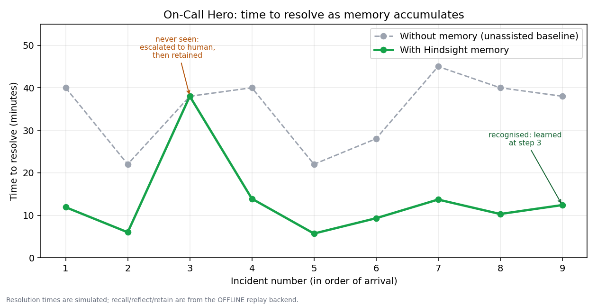

<div align="center">

# 🦸 On-Call Hero

### An incident copilot whose memory grows every time it's used.

*It tells you when it **doesn't** know. It learns from fixes that **fail**. It never runs a destructive command without a human.*

Built on [Hindsight](https://hindsight.vectorize.io) (Vectorize) + Groq for the **AI Agents That Learn Using Hindsight** hackathon · HackWithHyderabad 3.0

**Team Irani Chai & A.I** ☕🤖

[🎥 Demo video]([VIDEO_LINK]) · [📝 Article]([ARTICLE_LINK]) · [💼 LinkedIn]([LINKEDIN_LINK])

</div>

---

## The problem

It's 2:07 AM. PagerDuty fires: Redis is dying and checkout is degrading. Six weeks ago a teammate fixed this exact failure, but the postmortem is buried in a wiki nobody can search at 2 AM. And the engineer who fixed the *other* recurring failure left the company in June.

The most expensive minutes of an outage aren't the fix. They're the **re-diagnosis**.

## What On-Call Hero does

On-Call Hero remembers every incident, recalls the closest match the moment an alert fires, and **learns from every outcome**, including the fixes that fail.

| A stateless LLM says | On-Call Hero says |
|---|---|
| "Check logs, inspect resources, restart the pod." | "Matches **INC-104**, fixed by **Sarah Chen** in 40 min. Root cause: unbounded session cache after a TTL config change. Here is the exact command." |

## Why it's different from "a chatbot with memory"

| | |
|---|---|
| 🧠 **Live learning loop** | Writes a brand-new memory after an incident, verifies it is searchable, then recalls it on the next alert. Not just replaying data seeded that morning. |
| 🙋 **Honest "I don't know"** | On a failure it has never seen, it doesn't guess. It escalates to a human, retains the human's fix, and recognises the failure next time. |
| ❌ **Remembers failed fixes** | A dedicated `recall()` looks for remediations recorded as FAILED, so the same wrong fix is never suggested twice. |
| 🛡️ **Safety gate** | Read-only commands auto-run, mutating commands need human approval, destructive ones (`flushall`, `rm -rf /`, `drop table`) are blocked, and unknown commands fail closed. |
| 🚫 **No hallucinated citations** | The agent may only cite incident IDs that were actually recalled. Anything else is discarded and confidence is forced low. |
| 🕰️ **Tribal-knowledge insights** | `reflect()` over the whole memory bank surfaces runbooks whose owner has left the company. |
| 📝 **Auto-postmortems** | A postmortem is drafted the moment an incident closes, and retained. |



*Time to resolve across 9 alerts against a fresh memory bank. Step 3 is a failure the agent had never seen: it escalates, a human fixes it, the fix is retained, and at step 9 the agent recognises it. Resolution times are simulated. This chart was generated on [the offline replay backend / live Hindsight: EDIT THIS].*

## What's real and what's simulated

We'd rather be upfront than oversell. Everything simulated is also labelled on screen.

| ✅ Real | 🧪 Simulated |
|---|---|
| Hindsight `retain()` / `recall()` / `reflect()` calls | Remediation execution (`runbooks.py`): no cluster is touched |
| Groq LLM reasoning over recalled memory | Resolution *times* (a fix the agent already knows takes 25-40% of the original time, floor 4 min) |
| The retain → recall learning loop, including verifying the new memory is searchable | The $ figure: simulated minutes saved × `OUTAGE_COST_PER_MINUTE`, an assumption you set |
| Safety gate, postmortem drafting, failure learning | Incident data (10 synthetic but realistic incidents with real-looking log lines) |

## How Hindsight is used

Memory is the product, not a feature. Every call lives in [`src/hindsight_memory.py`](src/hindsight_memory.py).

| Operation | When | What it does |
|---|---|---|
| `retain()` | seeding | Loads 10 postmortems (symptom, root cause, fix, resolver, **log evidence**) |
| `retain()` | after every incident | Stores the *outcome* live: successes teach what works, **failures teach what not to repeat** |
| `recall()` | every alert | Finds the closest past incidents from the alert text and log lines |
| `recall()` | every alert | Second dedicated query for remediations recorded as **FAILED** for a similar symptom |
| `recall()` | after every retain | Polls until the new memory is searchable, so "recall what we just learned" never races the write |
| `reflect()` | every alert | Reasons over memory to name the root cause, matching incident, resolver and exact fix |
| `reflect()` | team insights | Reasons over the whole bank: recurring themes, **knowledge-loss risk**, failed fixes |

**Isn't this just RAG over postmortems?** RAG retrieves documents. On-Call Hero retains *outcomes* (including failures), reflects across the whole bank for institutional insights, and updates its memory *during operation*.

## Quickstart

```bash
pip install -r requirements.txt
cp .env.example .env                      # add GROQ_API_KEY and HINDSIGHT_API_KEY
python scripts/seed_memory.py --fresh     # load 10 past incidents into Hindsight
python scripts/demo.py                    # full story (~2 min)
python scripts/demo.py --quick            # 60-second cut
streamlit run app.py                      # dashboard
python scripts/learning_curve.py          # learning-curve simulation
python -m unittest discover -s tests -v   # 23 tests, no network needed
```

**No keys or Wi-Fi?** Add `--offline` to any script, or tick "Offline replay mode" in the dashboard. A local stand-in for Hindsight and Groq runs the same code paths and is always labelled OFFLINE.

## Architecture

```
alert + logs ─▶ workflow.triage()
                 ├─ agent.handle_alert_stateless()      generic LLM (the "before")
                 └─ agent.handle_alert_with_memory()
                      ├─ recall()  similar incidents ┐
                      ├─ recall()  FAILED attempts   ├─▶ Groq structures one grounded recommendation
                      └─ reflect() reasoning         ┘   (IDs validated against recalled memory)
                            │
                 guardrails.gate()  ──▶ auto | approval | escalate | blocked
                            │
            workflow.resolve()  run fix (simulated) or human resolves
                 ├─ retain() outcome ─▶ wait_until_recallable() ─▶ next alert recalls it
                 └─ postmortem.draft_postmortem()
```

```
oncall-hero/
├── README.md · requirements.txt · .env.example · app.py (dashboard)
├── data/     past_incidents.json (10, with logs) · incoming_alerts.json (9)
├── src/      config · hindsight_memory · agent · guardrails · workflow · runbooks
│             postmortem · metrics · simulation · mock_backends (offline) · ui
├── scripts/  seed_memory.py · demo.py · learning_curve.py
├── tests/    test_core.py (23 tests)
└── docs/     learning_curve.png
```

## Design decisions

- **Hindsight is called from code, not exposed as an LLM tool.** No function-calling step can fail mid-incident, and the recall → reflect → answer order is deterministic.
- **Honest uncertainty over confident guessing.** A wrong runbook at 2 AM is worse than "I don't know, paging a human."
- **Fail closed.** Unknown commands need approval. Destructive ones never run.
- **Resilient.** Retries, a model fallback chain (`llama-3.3-70b` → `gpt-oss-120b` → `qwen3-32b`), tolerant JSON parsing, and graceful degradation.
- **Tested.** 23 unit tests cover recall accuracy, the live retain → recall loop, learning a new failure, failure memory, hallucination guarding, model fallback, retries, the safety gate and the metrics math.

## Roadmap

PagerDuty / Opsgenie webhooks · Slack front-end with an Approve button · real `kubectl` execution behind the gate · cross-service cascade detection · per-team memory banks with access control.

## Team Irani Chai & A.I ☕🤖

| Name |
|---|
| Mehek |
| Mahima |
| Harshini |

Built for **HackWithHyderabad 3.0**.